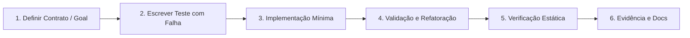

# Estratégia de Testes e Ciclo de Qualidade

Este documento codifica o ciclo obrigatório de testes e qualidade deste projeto.
Nenhuma mudança é integrada sem evidência automatizada nos níveis exigidos.

---

## 1. O Loop de Implementação

1. **Contratos**: especificar tipos, rotas e critérios de aceitação.
2. **Teste inicial**: escrever o teste que verifica o comportamento esperado antes de implementar.
3. **Implementação**: código limpo, modular e sem estado escondido.
4. **Refatoração**: aplicar Clean Code sem quebrar teste existente.
5. **Verificação estática**: tipos, build e suíte completa.
6. **Evidência e documentação**: atualizar a documentação afetada e o `CHANGELOG.md`.

---

## 2. As Camadas de Teste

### A. Funcionalidade
- **Testes unitários**: determinísticos, sem rede. Cobrem `packages/project-data` e os helpers de rota.
- **Testes de integração sobre o build**: a suíte principal roda contra o HTML realmente emitido, não contra fontes. Ela cobre a existência das rotas bilíngues, a proveniência e a licença, a integração entre página de projeto e documentação, a paridade de idioma, a identidade visual por projeto e a resolução de todo link interno.

### B. Conformidade e Validação Estática
- **Tipos**: `pnpm check` executa `vue-tsc --noEmit` em modo estrito, incluindo `noUncheckedIndexedAccess` e `exactOptionalPropertyTypes`.
- **Build**: `pnpm build` falha em qualquer link interno quebrado, porque a checagem de dead links do VitePress está ativa.
- **Schema**: o manifesto de fontes é gerado a partir do registro tipado, e um teste exige que todo `localPath` exista em disco e que toda revisão e blob tenha 40 caracteres hexadecimais.

### C. Segurança (DevSecOps)
- **Varredura de segredos**: proibição de chaves, senhas ou tokens no código.
- **Auditoria de dependências**: bloqueio de bibliotecas com aviso crítico ou licença incompatível.
- **Proveniência**: a importação confere cada blob com `git rev-parse` na revisão fixada e aborta se divergir, então uma cópia local não pode conter conteúdo de outro estado do upstream.

### D. Performance, Carga e Estresse
- O site é estático e não possui backend nem estado de usuário, então não há runtime de servidor para testar sob carga.
- A checagem de dead links do build e a varredura de links da suíte cobrem o custo real de publicação.

### E. Frontend, UI e Experiência
- **Semântica e foco**: skip link, `main` com `tabindex`, `aria-label` nos marcos de navegação e contorno de foco visível.
- **Movimento**: `prefers-reduced-motion` desliga animações e transições.
- **Revisão em navegador ainda pendente**: este ambiente não tem navegador, então a verificação visual, por teclado e por leitor de tela continua sendo uma limitação declarada em `PROJECT_STATE.md`.

---

## 3. Comandos

| Categoria | Comando | Script |
|-----------|---------|--------|
| Tipos | `vue-tsc --noEmit` | `pnpm check` |
| Testes | `vitest run` | `pnpm test` |
| Build estático | `vitepress build site` | `pnpm build` |
| Desenvolvimento | `vitepress dev site` | `pnpm dev` |
| Conteúdo derivado | importação + stubs de rota | `pnpm content` |
| Validação do scaffold | `prumo validate . && prumo doctor .` | `pnpm validate:prumo` |
