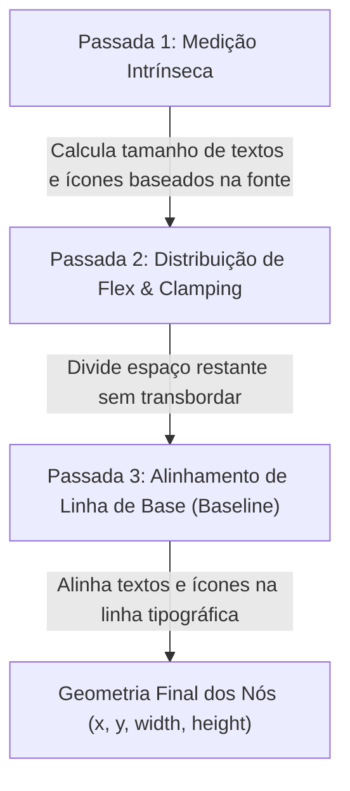

::: info Cópia estática
Copiado de `docs/zoe/guide/layout-leona.md` em [https://github.com/poppy-team/aipo-lang](https://github.com/poppy-team/aipo-lang) (MIT).
Fixado na revisão `7d51026653301c3048a41e2cf4026e3429c3a3b9`, blob `6b49378c91649b4ed54b0de2bcc4fef199ae3dbd`.
O repositório de origem permanece canônico; esta cópia é atualizada por um pull request de sincronização, não em tempo real.
:::
# O Motor de Layout Leona 2.0

O **Leona** é o motor de layout canônico do Zoe UI. Desenvolvido inteiramente em Aipo, ele resolve coordenadas $(x, y)$, larguras e alturas relativas com precisão geométrica em três passadas determinísticas.

---

## 1. As Três Passadas do Leona 2.0

### Passada 1: Medição Intrínseca
Nós folha (como `label`, `icon`, `button`, `badge`, `segment_item`) calculam seu tamanho exato usando as métricas da fonte TTF via `host_measure_text` e `host_font_metrics`. Nenhum contêiner recebe tamanhos mágicos ou arbitrários.

### Passada 2: Distribuição Flex
Elementos com `width: "flex"` ou `height: "flex"` compartilham o espaço livre restante no eixo principal de forma rigorosa:

$$\text{flex\_size} = \frac{\text{espaço\_disponível} - \text{espaço\_usado}}{\text{número\_de\_flex}}$$

Se você possui 3 campos `scrubber_input` em uma linha com 240px de largura e gap de 6px:
$$\text{flex\_size} = \frac{240 - 2 \times 6}{3} = 76.0\text{px}$$

### Passada 3: Alinhamento pela Linha de Base
Em contêineres horizontais (`row`) configurados com `align_items: "baseline"`, ícones e textos de tamanhos variados são alinhados não pelo centro matemático da caixa, mas pela linha inferior das letras sem descendentes (*baseline*). Isso confere a sofisticação tipográfica de publicações impressas e ferramentas de ponta.

---

## 2. Propriedades Universais de Dimensão

Todo componente ou retângulo no Zoe aceita as seguintes propriedades de dimensionamento:

| Propriedade | Exemplo | Descrição |
| :--- | :--- | :--- |
| `width`, `height` | `120.0` | Tamanho fixo em pixels |
| `width`, `height` | `"100%"`, `"50%"` | Porcentagem do espaço disponível no contêiner pai |
| `width`, `height` | `"flex"` | Preenchimento elástico proporcional do espaço restante |
| `width`, `height` | `"auto"` | Ajusta-se (*hug content*) exatamente ao conteúdo dos filhos |
| `min_width`, `max_width` | `80.0`, `400.0` | Limites estritos de contenção |
| `min_height`, `max_height` | `24.0`, `600.0` | Limites estritos de altura |

---

## 3. Direções de Layout

- **`column`**: Organiza os filhos verticalmente, de cima para baixo.
- **`row`**: Organiza os filhos horizontalmente, da esquerda para a direita.
- **`stack`**: Sobrepõe os filhos uns sobre os outros, com suporte a deslocamentos `offset_x` e `offset_y`.
- **`wrap: true`**: Permite quebra automática em múltiplas linhas quando a largura do contêiner é excedida.
