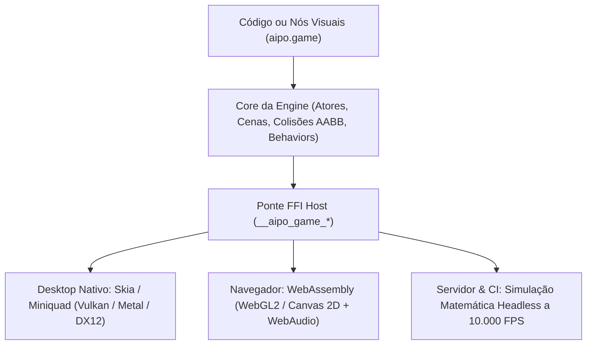
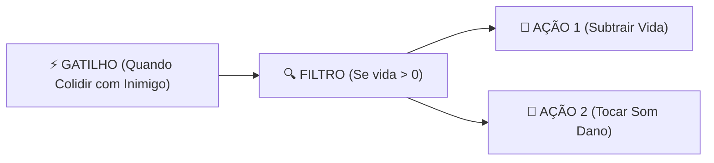

::: info Cópia estática
Copiado de `docs/packages/aipo-game.md` em [https://github.com/poppy-team/aipo-lang](https://github.com/poppy-team/aipo-lang) (MIT).
Fixado na revisão `3a5ce6737d42ae75470f7798680ebc95b3ac761c`, blob `a9ab33a865a7ccf2815baaa60536a5782023a6e7`.
O repositório de origem permanece canônico; esta cópia não é atualizada automaticamente.
:::
# aipo.game — Micro Game Engine 2D

`aipo.game` é a engine 2D oficial da linguagem Aipo para criação ágil e expressiva de jogos, inspirada nos melhores princípios de produtividade e facilidade do **Construct 3**, **ct.js** e **GameMaker Studio**, mas com a robustez e o desempenho da arquitetura nativa da Aipo.

---

## 1. Visão Geral & Filosofia

O desenvolvimento de jogos 2D não deve ser sobrecarregado por cerimônias de boilerplate ou motores excessivamente complexos. O `aipo.game` foi projetado com quatro pilares essenciais:

1. **Atores e Cenas Claros:** Cada entidade (`Actor`) possui seu próprio ciclo de vida (`on_create`, `on_update`, `on_collision`, `on_destroy`), encapsulando sua lógica e física.
2. **Behaviors Plugáveis em 1 Linha:** Funcionalidades completas como movimentação de plataforma, física de projétil ou barreiras sólidas são anexadas com uma única chamada declarativa.
3. **Simulação Determinística:** A aritmética e o estado da Aipo garantem simulações 100% reproduzíveis, viabilizando **Rollback Netcode** para multiplayer e saves de replay microscópicos.
4. **Programação Visual Anti-Espaguete:** O sistema de nós visuais segue o modelo estruturado **"Gatilho $\to$ Filtro $\to$ Ação"**, gerando código `.aipo` transparente e legível.



---

## 2. Instalação

Adicione ao seu `aipo.toml`:

```toml
[dependencies]
"aipo.game" = { path = "packages/aipo-game" }
```

---

## 3. Exemplo Prático: Jogo Espacial em 50 Linhas

```aipo
import aipo.game as g

# 1. Definição do Jogador
let Nave = g.actor("Nave", {
    sprite: "nave.png",
    behaviors: [
        g.behaviors.TopDown(speed: 250.0),
        g.behaviors.KeepInScreen()
    ],

    on_create: actor => {
        actor.vida = 100
        actor.cooldown = 0.0
    },

    on_update: (actor, dt) => {
        actor.cooldown -= dt
        
        # Atirar ao pressionar Barra de Espaço
        if g.input.key_down("Space") and actor.cooldown <= 0.0 {
            g.spawn(Laser, x: actor.x, y: actor.y - 18)
            g.audio.play("laser.wav")
            actor.cooldown = 0.15
        }
    },

    on_collision: (actor, other) => {
        if other.is_a(Asteroide) {
            actor.vida -= 20
            other.destroy()
            g.audio.play("explosao.wav")
        }
    }
})

# 2. Definição do Projétil
let Laser = g.actor("Laser", {
    sprite: "laser.png",
    behaviors: [
        g.behaviors.Bullet(speed: 600.0, angle: -90.0),
        g.behaviors.DestroyOutsideScreen()
    ]
})

# 3. Definição do Inimigo
let Asteroide = g.actor("Asteroide", {
    sprite: "asteroide.png",
    behaviors: [
        g.behaviors.Bullet(speed: 140.0, angle: 90.0),
        g.behaviors.DestroyOutsideScreen()
    ]
})

# 4. Montagem da Cena do Jogo
let FaseEspacial = g.scene("Fase1", {
    width: 800,
    height: 600,
    background: "#0d0e15",

    on_load: scene => {
        g.spawn(Nave, x: 400, y: 520)

        # Gerador de asteroides a cada 0.8s
        scene.timer(interval: 0.8, repeat: true, _ => {
            let posX = g.random.range(40, 760)
            g.spawn(Asteroide, x: posX, y: -20)
        })
    }
})

# 5. Ponto de Entrada
fn main() {
    g.start({
        title: "Space Defender — Aipo Game",
        width: 800,
        height: 600,
        initial_scene: FaseEspacial
    })
}
```

---

## 4. Catálogo de Comportamentos (*Behaviors*)

| Comportamento | Parâmetros Principais | Descrição |
|---|---|---|
| `g.behaviors.TopDown()` | `speed: 200.0`, `diagonal: true` | Movimentação em 8 direções com suporte automático a WASD, setas e gamepads. |
| `g.behaviors.Platformer()` | `speed: 200.0`, `jump_force: 400.0`, `gravity: 980.0` | Física clássica de plataforma com salto, gravidade e colisão de solo. |
| `g.behaviors.Bullet()` | `speed: 400.0`, `angle: 0.0` | Desloca a entidade em linha reta na direção e velocidade configuradas. |
| `g.behaviors.Solid()` | *(nenhum)* | Marca o ator como obstáculo intransponível para atores com movimentação. |
| `g.behaviors.WrapScreen()` | `margin: 16.0` | Faz a entidade reaparecer do lado oposto ao cruzar os limites da tela. |
| `g.behaviors.KeepInScreen()` | `margin: 0.0` | Impede a entidade de sair dos limites visíveis da janela. |
| `g.behaviors.DestroyOutsideScreen()` | `margin: 50.0` | Libera o ator da memória automaticamente ao sair do campo de visão. |

---

## 5. Sistema de Entrada e Áudio

### Teclado e Mouse
```aipo
# Checagens contínuas ou de clique único
if g.input.key_down("Space") { ... }
if g.input.key_pressed("Enter") { ... }

# Eixos analógicos normalizados (-1.0 a +1.0)
let ax = g.input.axis_x() # A/D ou Setas Esquerda/Direita
let ay = g.input.axis_y() # W/S ou Setas Cima/Baixo

# Coordenadas do mouse
let mx = g.input.mouse_x()
let my = g.input.mouse_y()
let clicou = g.input.mouse_down("left")
```

### Efeitos Sonoros e Trilha Sonora
```aipo
# Reprodução de arquivos de áudio externos
g.audio.play("tiro.wav")
g.audio.play_sound("tiro.wav", volume: 0.8, pitch: 1.2)
g.audio.play_music("trilha_fase1.ogg", volume: 0.5, loop: true)

# Síntese Procedural Chiptune (Estilo SFXR) — Zero arquivos externos necessários!
g.audio.sfx("coin")       # Moeda / Coleta
g.audio.sfx("jump")       # Pulo com curva ascendente
g.audio.sfx("laser")      # Disparo de projétil
g.audio.sfx("explosion")  # Explosão em ruído branco
g.audio.sfx("powerup")    # Upgrade sonoro
```

---

## 6. Animações com Tweening & "Game Juice"

O módulo de tweening (`aipo.game.tween`) confere elasticidade e vida ao jogo com interpolações suaves e curvas de aceleração:

```aipo
# Squash & Stretch ao aterrissar ou pular
g.animate(heroi, prop: "scale_x", to_val: 1.3, duration: 0.1, ease_fn: g.ease_out)
g.animate(heroi, prop: "scale_y", to_val: 0.7, duration: 0.1, ease_fn: g.ease_out, on_complete: _ => {
    # Retorna ao tamanho normal com efeito elástico
    g.animate(heroi, prop: "scale_x", to_val: 1.0, duration: 0.2, ease_fn: g.bounce_out)
    g.animate(heroi, prop: "scale_y", to_val: 1.0, duration: 0.2, ease_fn: g.bounce_out)
})
```

---

## 7. Sistema de Nós Visuais Anti-Espaguete

O módulo `aipo.game.nodes` implementa a arquitetura de programação visual para ferramentas visuais (como o futuro **Aipo Game Studio**).

Em vez de nós desordenados e teias de fios cruzados, a programação visual é estruturada em trilhas de **Gatilho $\to$ Filtro $\to$ Ação**:



### Bilinguismo Visual/Texto
Qualquer regra montada visualmente transcreve diretamente para código canônico da Aipo:

```aipo
import aipo.game.nodes as n

let regra_colisao = n.rule(
    "DanoNoInimigo",
    trigger: n.trigger("on_collision", { "with": "Inimigo" }),
    filters: [ n.filter("actor.vy", ">", "0") ],
    actions: [
        n.action("destroy", { "target": "other" }),
        n.action("play_sound", { "file": "impacto.wav" })
    ]
)

# O compilador de nós gera código limpo para estudo ou edição manual:
let codigo_gerado = n.transpile_to_aipo_code(regra_colisao)
```

---

## 8. Máquina de Estados e Animação de Sprites (`g.animation`)

O subsistema `g.animation` gerencia sequências de quadros a partir de spritesheets tabulares, permitindo transições fluidas de estado e espelhamento horizontal instantâneo:

```aipo
import aipo.game as g

# Criação do animador para textura de ID 1
let anim = g.animation.create_animator(1)

# Definição dos clipes da entidade
let idle = g.animation.create_clip("idle", [0, 1, 2, 3], 6.0, true, 32.0, 32.0, 4)
let run = g.animation.create_clip("run", [4, 5, 6, 7], 12.0, true, 32.0, 32.0, 4)
let attack = g.animation.create_clip("attack", [8, 9, 10], 14.0, false, 32.0, 32.0, 4)

g.animation.add_clip(anim, idle)
g.animation.add_clip(anim, run)
g.animation.add_clip(anim, attack)

# Reprodução e controle de quadro
g.animation.play(anim, "run", false)
g.animation.update(anim, dt)

# Desenho com recorte UV automático e espelhamento horizontal
g.animation.draw(anim, x, y, 64.0, 64.0, 0.0, flip_x)
```

---

## 9. Sistema de Partículas 2D com Física (`g.particles`)

O módulo `g.particles` implementa emissores leves para efeitos visuais com arrasto dinâmico, aceleração gravitacional, atenuação contínua de opacidade (*alpha fading*) e presets prontos para jogos:

```aipo
import aipo.game as g

# Criação de emissor de partículas com teto máximo de 256 partículas ativas
let fx = g.particles.create_emitter(400.0, 300.0, 256)

# Disparo de presets visuais integrados
g.particles.emit_preset(fx, "sparks", 400.0, 300.0, 20)    # Faíscas pirotécnicas
g.particles.emit_preset(fx, "explosion", 400.0, 300.0, 30) # Onda de choque e fogo
g.particles.emit_preset(fx, "dust", 400.0, 324.0, 4)       # Poeira de passos
g.particles.emit_preset(fx, "coins", 400.0, 300.0, 12)     # Moedas douradas
g.particles.emit_preset(fx, "smoke", 400.0, 300.0, 8)      # Fumaça ascendente

# Atualização física (gravidade e atrito aerodinâmico) e renderização GPU
g.particles.update(fx, dt)
g.particles.draw(fx)
```

---

## 10. Host Nativo Desktop (`aipo-game-host`)

O crate `crates/aipo-game-host` é o executor desktop oficial alimentado pelo backend gráfico ultrarrápido **Miniquad / Macroquad**. Ele compila e executa qualquer script `.aipo` diretamente na GPU a 60 FPS com suporte a janelas redimensionáveis, entrada em tempo real e hot-reload dinâmico.

### Como Executar

```bash
# Executa a demonstração de Animação de Sprites e Partículas 2D
cargo run -p aipo-game-host -- packages/aipo-game/examples/animation_and_particles.aipo

# Executa a demonstração com Tilemap 2D e HUD Imediato
cargo run -p aipo-game-host -- packages/aipo-game/examples/tilemap_and_hud.aipo

# Executa o exemplo com câmera 2D e coleta de gemas
cargo run -p aipo-game-host -- examples/27_camera_and_sprites.aipo

# Executa o Snake Game nativo embutido (quando chamado sem parâmetros)
cargo run -p aipo-game-host
```

### Hot-Reload em Tempo Real
Durante a execução de qualquer script `.aipo`:
- Pressione **F5** ou **Ctrl+R** para recompilar o script e recarregar os dados na hora sem reiniciar a janela.
- Caso ocorra um erro de sintaxe ou tipo durante o recarregamento, um overlay de diagnóstico é renderizado diretamente sobre a tela do jogo com as mensagens e números de linha.

### Ciclo de Vida do Script (.aipo)
O host detecta automaticamente ganchos de ciclo de vida definidos no script:
1. `setup()` ou `on_init()`: Executado uma única vez na inicialização.
2. `update(dt)`: Executado a cada quadro com o delta de tempo em segundos (`dt`).
3. `draw()`: Executado a cada quadro para emissão de comandos de renderização na GPU.

### Catálogo de Funções FFI do Host

| Função Host | Parâmetros | Descrição |
|---|---|---|
| `host_clear_background(r, g, b)` | `r, g, b: Float` | Limpa o framebuffer com a cor especificada (0.0 a 1.0). |
| `host_draw_rect(x, y, w, h, r, g, b, a)` | `Float` | Desenha um retângulo preenchido na tela ou no espaço do mundo. |
| `host_draw_rect_lines(x, y, w, h, th, r, g, b, a)` | `Float` | Desenha as bordas de um retângulo com espessura `th`. |
| `host_draw_line(x1, y1, x2, y2, th, r, g, b, a)` | `Float` | Desenha uma linha de espessura `th` entre dois pontos. |
| `host_draw_circle(cx, cy, radius, r, g, b, a)` | `Float` | Desenha um círculo preenchido. |
| `host_draw_text(text, x, y, size, r, g, b)` | `String, Float...` | Renderiza texto com tamanho de fonte especificado. |
| `host_load_texture(path)` | `String -> Int` | Carrega uma imagem PNG/JPEG na memória da GPU e retorna seu ID numérico. |
| `host_draw_sprite(tex_id, x, y, w, h, rot, flip_x)` | `Int, Float..., Bool` | Renderiza uma textura ou sprite com escala, rotação e espelhamento horizontal. |
| `host_draw_sprite_subrect(tex_id, sx, sy, sw, sh, dx, dy, dw, dh, flip_x)` | `Int, Float..., Bool` | Renderiza uma fatia de spritesheet (atlas de textura). |
| `host_set_camera(target_x, target_y, zoom)` | `Float, Float, Float` | Ativa a câmera 2D focada em `(target_x, target_y)` com fator de zoom. |
| `host_reset_camera()` | *(nenhum)* | Restaura o sistema de coordenadas para a tela (HUD e interface de usuário). |
| `host_load_sound(path)` | `String -> Int` | Carrega arquivo de áudio WAV/OGG em memória e retorna ID numérico de handle. |
| `host_play_sound(id, volume, pitch)` | `Int, Float, Float` | Reproduz som por ID com controle de volume e pitch. |
| `host_play_preset(name, volume, pitch)` | `String, Float, Float` | Reproduz som procedural chiptune ("coin", "jump", "laser", "explosion", "hit", "powerup", "click"). |
| `host_synth_sound(wave, freq, slide, dur, vol)` | `String, Float... -> Int` | Sintetiza onda sonora em memória gerando WAV 16-bit e retorna handle. |
| `host_stop_sound(id)` | `Int` | Interrompe o som correspondente ao ID. |
| `host_play_music(id, volume, loop)` | `Int, Float, Bool` | Toca trilha musical em loop contínuo. |
| `host_stop_music()` | *(nenhum)* | Para imediatamente a música de fundo. |
| `host_key_down(code)` | `Int -> Bool` | Retorna `true` se a tecla especificada (código GLFW) estiver pressionada. |
| `host_key_pressed(code)` | `Int -> Bool` | Retorna `true` no frame exato em que a tecla foi acionada. |
| `host_mouse_x()`, `host_mouse_y()` | `() -> Float` | Retorna a posição do cursor do mouse em coordenadas da tela. |
| `host_mouse_btn(btn)` | `Int -> Bool` | Retorna se o botão do mouse (0=Esquerdo, 1=Direito, 2=Meio) está pressionado. |
| `host_screen_width()`, `host_screen_height()` | `() -> Float` | Dimensões atuais da janela em pixels. |
| `host_frame_time()` | `() -> Float` | Delta time real do frame anterior em segundos. |

