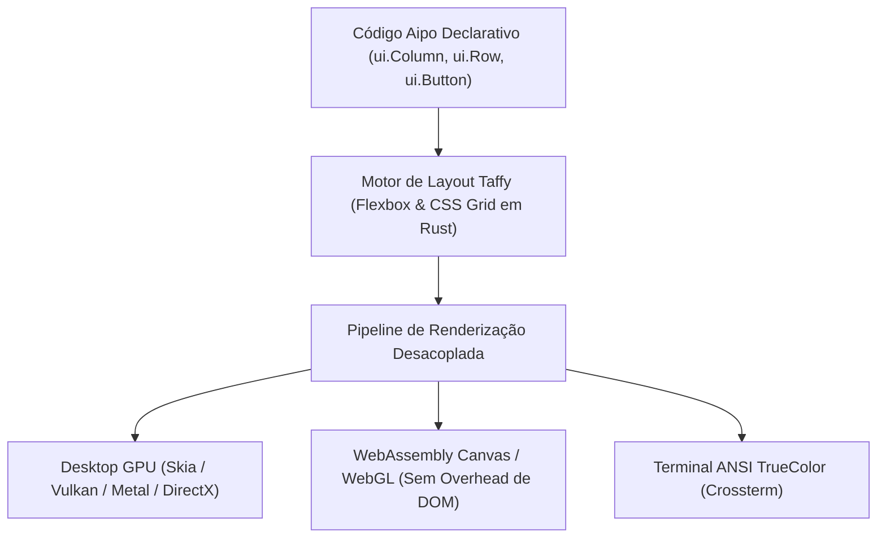

::: info Cópia estática
Copiado de `docs/packages/aipo-ui.md` em [https://github.com/poppy-team/aipo-lang](https://github.com/poppy-team/aipo-lang) (MIT).
Fixado na revisão `d9f9557e04871546a92b7ca1fcbc7e6f116803f8`, blob `15800b75364d269bb3206054950cda9516be2b09`.
O repositório de origem permanece canônico; esta cópia é atualizada por um pull request de sincronização, não em tempo real.
:::
# aipo.ui — Framework Universal de Interface Multiplataforma

`aipo.ui` é o framework oficial da linguagem Aipo para construção de interfaces gráficas declarativas universais, capazes de rodar nativamente em **Desktop (GPU)**, na **Web (Canvas/WebGL via WebAssembly)** e no **Terminal (TUI)** a partir de uma única base de código.

---

## 1. Visão Geral & Separação de Domínios

No ecossistema Aipo, a separação de responsabilidades é rigorosa:

- **[`aipo.html`](https://github.com/poppy-team/aipo-lang/blob/d9f9557e04871546a92b7ca1fcbc7e6f116803f8/docs/packages/aipo-html)**: Projetado exclusivamente para a web tradicional. Opera sobre a árvore DOM do navegador (`<div>`, `<span>`, CSS web, Tailwind).
- **`aipo.ui`**: 100% agnóstico de plataforma. Constrói uma árvore declarativa de nós de layout e controles de alto nível, calcula a geometria espacial com o motor Rust **Taffy** e delega o desenho a renderizadores desacoplados.



---

## 2. Instalação

Adicione ao `aipo.toml` do seu projeto:

```toml
[dependencies]
"aipo.ui" = { path = "packages/aipo-ui" }
```

---

## 3. Exemplo Rápido: Aplicação Universal

```aipo
import aipo.ui as ui
import aipo.ui.color as color

struct Model {
    count: Int
    theme_dark: Bool
}

enum Msg {
    Increment,
    Decrement,
    ToggleTheme
}

fn update(m: Model, msg: Msg) -> Model {
    match msg {
        Msg::Increment => Model{ count: m.count + 1, theme_dark: m.theme_dark },
        Msg::Decrement => Model{ count: m.count - 1, theme_dark: m.theme_dark },
        Msg::ToggleTheme => Model{ count: m.count, theme_dark: !m.theme_dark }
    }
}

fn view(m: Model, dispatch: Fn) {
    let bg_color = if m.theme_dark { color.gray_900 } else { color.gray_100 }
    let card_bg = if m.theme_dark { color.gray_800 } else { color.white }
    let text_color = if m.theme_dark { color.white } else { color.gray_900 }

    ui.Column(
        width: "100%",
        height: "100%",
        padding: 32,
        align: ui.Align::Center,
        justify: ui.Justify::Center,
        background: bg_color
    ) {
        ui.Box(
            padding: 24,
            border_radius: 12.0,
            background: card_bg,
            align: ui.Align::Center
        ) {
            ui.Text("Aipo UI Multiplataforma", font_size: 24, font_weight: "bold", color: text_color)
            ui.Spacer()
            
            ui.Text(f"Valor: {m.count}", font_size: 40, font_weight: "bold", color: color.blue_500)
            
            ui.Row(gap: 8, padding: 16) {
                ui.Button("+1", on_click: _ => dispatch(Msg::Increment), variant: "primary")
                ui.Button("-1", on_click: _ => dispatch(Msg::Decrement), variant: "secondary")
                ui.Button("Alternar Tema", on_click: _ => dispatch(Msg::ToggleTheme))
            }
        }
    }
}

fn main() {
    ui.mount_desktop(
        title = "Aipo UI Demo",
        width = 500,
        height = 400,
        init = Model{ count: 0, theme_dark: true },
        update = update,
        view = view
    )
}
```

---

## 4. Primitivas de Layout

As primitivas de layout utilizam blocos finais (*trailing blocks*) `{ ... }` e traduzem diretamente para as regras padrão de CSS Flexbox e Grid do motor **Taffy**:

### `ui.Column`
Empilha seus filhos verticalmente:
```aipo
ui.Column(gap: 12, padding: 16, align: ui.Align::Center) {
    ui.Text("Item 1")
    ui.Text("Item 2")
    ui.Text("Item 3")
}
```

### `ui.Row`
Distribui os filhos horizontalmente em linha:
```aipo
ui.Row(gap: 8, justify: ui.Justify::SpaceBetween) {
    ui.Text("Esquerda")
    ui.Text("Direita")
}
```

### `ui.Stack`
Posiciona elementos sobrepostos na mesma área (eixo Z), útil para badges, camadas de fundo e sobreposições flutuantes:
```aipo
ui.Stack(width: 200, height: 120) {
    ui.Box(background: color.gray_200, width: "100%", height: "100%")
    ui.Text("Sobreposto", align: "center")
}
```

### `ui.ScrollArea`
Área rolável para listas ou conteúdos extensos com recorte (*clipping*) acelerado:
```aipo
ui.ScrollArea(height: 300, direction: "vertical") {
    each item in lista_itens {
        ui.Text(item)
    }
}
```

### `ui.Spacer`
Elemento elástico com `flex_grow: 1` que empurra os elementos adjacentes para as extremidades.

---

## 5. Controles e Componentes Interativos

| Componente | Parâmetros Principais | Exemplo |
|---|---|---|
| `ui.Text` | `content`, `font_size`, `font_weight`, `color`, `align` | `ui.Text("Olá Mundo", font_size: 16)` |
| `ui.Button` | `label`, `on_click`, `variant`, `disabled` | `ui.Button("Salvar", on_click: _ => dispatch(Msg::Save))` |
| `ui.TextInput` | `value`, `placeholder`, `on_change`, `disabled` | `ui.TextInput(placeholder: "Nome...", on_change: val => dispatch(Msg::SetNome(val)))` |
| `ui.Slider` | `value`, `min`, `max`, `step`, `on_change` | `ui.Slider(value: 50.0, min: 0.0, max: 100.0)` |
| `ui.Checkbox` | `checked`, `label`, `on_toggle` | `ui.Checkbox(checked: true, label: "Aceito os termos")` |
| `ui.ProgressBar` | `progress` (0.0 a 1.0), `height`, `color` | `ui.ProgressBar(progress: 0.75, color: color.emerald_500)` |

---

## 6. Sistema de Cores e Estilos Tipados

O submódulo `aipo.ui.color` oferece construtores seguros e a paleta padrão do sistema:

```aipo
import aipo.ui.color as color

# Construtores
let c1 = color.rgb(30, 41, 59)
let c2 = color.rgba(255, 255, 255, 0.8)
let c3 = color.hex("#4f46e5")

# Paleta Integrada
color.white
color.black
color.gray_900
color.blue_500
color.emerald_500
color.red_500
```

---

## 7. Renderizadores e Pontos de Montagem

Dependendo do seu alvo de compilação, o `aipo.ui` se adapta automaticamente ou permite montagem explícita:

### Desktop GPU Nativo (`mount_desktop`)
Renderiza uma janela nativa via Skia acelerada por GPU (Vulkan no Linux, Metal no macOS, DirectX 12 no Windows):
```aipo
ui.mount_desktop(
    title = "Aplicação Desktop",
    width = 1024,
    height = 768,
    init = init_state,
    update = update,
    view = view
)
```

### WebAssembly Canvas 2D / WebGL (`mount_canvas`)
Compila diretamente para WebAssembly e desenha em um elemento `<canvas id="app-canvas">`, contornando completamente o DOM para jogos, ferramentas de design e dashboards de alta frequência:
```aipo
ui.mount_canvas("app-canvas", init = init_state, update = update, view = view)
```

### Terminal TUI (`mount_tui`)
Permite rodar painéis de controle, ferramentas de desenvolvedor e visualizadores de métricas diretamente no console sem ambiente gráfico:
```aipo
ui.mount_tui(init = init_state, update = update, view = view)
```
