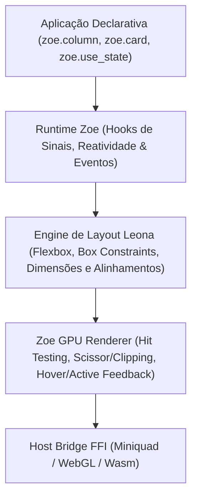

::: info Cópia estática
Copiado de `docs/packages/aipo-zoe.md` em [https://github.com/poppy-team/aipo-lang](https://github.com/poppy-team/aipo-lang) (MIT).
Fixado na revisão `7d51026653301c3048a41e2cf4026e3429c3a3b9`, blob `14e99698319fc02b475d9c26dbc05ec209003e6a`.
O repositório de origem permanece canônico; esta cópia é atualizada por um pull request de sincronização, não em tempo real.
:::
# aipo.zoe — Framework Declarativo de GUI e Engine Leona

`aipo.zoe` (Zoe UI) é o framework canônico da linguagem Aipo para construção de interfaces gráficas declarativas de alto desempenho e ricas em dados, com renderização acelerada por GPU a 60+ FPS via [`aipo-game-host`](https://github.com/poppy-team/aipo-lang/blob/7d51026653301c3048a41e2cf4026e3429c3a3b9/docs/packages/aipo-game), gerenciamento reativo de estado com hooks (`use_state`) e o motor de layout hierárquico **Leona**.

---

## 1. Visão Geral & Filosofia de Design

O Zoe UI foi concebido com uma premissa inegociável: **código puramente escrito em Aipo**, eliminando camadas pesadas de C++, Electron ou wrappers de widgets do sistema operacional, sem sacrificar a aceleração por hardware ou a ergonomia moderna.



### Pilares Fundamentais:
1. **Zero Bloat Nativo na Camada de UI:** Toda a hierarquia de componentes, o cálculo de caixas delimitadoras e o gerenciamento de eventos são expressos na própria sintaxe da Aipo.
2. **Reatividade Previsível e Determinística:** Mudanças de estado notificam o ciclo de atualização (`step(dt)`), orquestrando reavaliação limpa e livre de *side-effects* fantasmas.
3. **Foco em Ferramentas e Game Engines:** Suporte de primeira classe para viewports com recorte em GPU (*scissor*), splitters redimensionáveis, abas de hierarquia, câmera orbital 2D/3D e gizmos de transformação visual.
4. **Multiplataforma por Natureza:** Executa hoje na máquina virtual nativa de desktop (Linux, macOS, Windows) e possui alinhamento estrutural para WebAssembly (`aipo-wasm`) e JavaScript (`aipo-js`).

---

## 2. Instalação & Uso Básico

Adicione ao `aipo.toml` do seu projeto:

```toml
[dependencies]
"aipo.zoe" = { path = "packages/aipo-zoe" }
```

### Exemplo: Contador Reativo com Design System Embutido

```aipo
import aipo.zoe as zoe

fn view() {
    let count = zoe.use_state(0)

    return zoe.center({ "background": zoe.color.base, "gap": 16.0 }, [
        zoe.label(f"Contador: {count.get()}", {
            "font_size": 24.0,
            "color": zoe.color.text
        }),
        zoe.row({ "gap": 12.0 }, [
            zoe.button("+1 Incrementar", _ => zoe.set_state(count, count.get() + 1), {
                "variant": "primary",
                "background": zoe.color.blue
            }),
            zoe.button("Zerar", _ => zoe.set_state(count, 0), {
                "variant": "danger",
                "background": zoe.color.red
            })
        ])
    ])
}

fn setup() {
    zoe.mount(view)
}

fn update(dt) {
    zoe.step(dt)
}

fn draw() {
    zoe.draw_ui()
}
```

---

## 3. Análise Comparativa de Mercado (Inspirações Filosóficas)

Para planejar a evolução do Zoe UI, analisamos as melhores ferramentas do mercado que compartilham a mesma filosofia: *UI declarativa desenhada diretamente em GPU/Canvas na própria linguagem*:

| Framework / Biblioteca | Substrato / Linguagem | Pontos em Comum com o Zoe | Lições & Inspirações Práticas |
| :--- | :--- | :--- | :--- |
| **[Freya GUI](https://freyaui.dev/)** | Rust + **Torin Layout** + Skia | O parente mais próximo. Possui sua própria engine de layout orientada a nós (**Torin**), reatividade por sinais e renderização em canvas. | **Cache de nós de layout:** Torin só recalcula nós cujas propriedades, tamanho disponível ou filhos foram alterados. |
| **[Flutter](https://flutter.dev/)** | Dart + Impeller/Skia | Renderização direta em GPU sem widgets do SO; árvore declarativa pura na linguagem hospedeira. | **Protocolo Bidirecional de Layout:** *"Constraints descem, tamanhos sobem, pai define posição"*. Elimina ambiguidades e roda em $O(N)$ rigoroso. |
| **[Egui](https://github.com/emilk/egui)** | Rust (Immediate Mode) | Foco absoluto em ferramentas de desenvolvedor, game engines, debuggers e editores visuais leves. | **Camadas de sobreposição flutuante (Overlays/Portals):** Menus de contexto com clique direito, tooltips com atraso de hover e janelas modais simples. |
| **[SolidJS](https://www.solidjs.com/)** | TypeScript (Fine-Grained Signals) | Reatividade cirúrgica sem a sobrecarga de reconciliação de Virtual DOM completo. | **Sinais finos e computados (`use_memo` / `use_effect`):** Disparar re-layout granular apenas na sub-árvore afetada, em vez de invalidar a janela inteira. |
| **[Slint](https://slint.dev/)** | Rust/C++ | Interface declarativa com memória linear microscópica e propriedades vinculadas. | **Constraints mínimos e máximos:** `min_width`, `max_width`, `min_height`, `max_height` como cidadãos de primeira classe no layout. |

---

## 4. Eixos de Amadurecimento Arquitetural

A partir da auditoria da base de código do Zoe UI, definem-se 6 eixos estratégicos de aprimoramento:

### Eixo 1: Engine de Layout Leona 2.0 (Constraints & Cache)
* **Medição Bidirecional (Constraints Go Down, Sizes Go Up):**
  A engine Leona adotará duas passadas limpas:
  1. *Passada de Medição (Bottom-Up):* Filhos reportam tamanho intrínseco mínimo e ideal ao container pai.
  2. *Passada de Posicionamento (Top-Down):* O container pai impõe limites restritivos e calcula posições absolutas `(x, y)`.
* **Constraints Mínimos e Máximos:** Suporte nativo a `min_width`, `max_width`, `min_height` e `max_height` em todos os elementos e containers.
* **Quebra de Linha em Múltiplas Linhas (`wrap: true`):** Suporte a layout em grade fluida para paletas de ferramentas, galerias de mídia e grupos de tags.
* **Cache de Layout (Torin-Style):** Elementos estáticos com mesmas restrições reutilizam a geometria pré-computada em $O(1)$.
* **Medição Tipográfica Real via Host:** Substituição da aproximação monospace fixa por `host_measure_text(text, font_size) -> [w, h]` na camada de host.

### Eixo 2: Reatividade Fina & Hooks Avançados
* **`use_memo`:** Cálculo de estado derivado com cache dependente de sinais:
  ```aipo
  let filtered = zoe.use_memo([query, items], fn() {
      return items.get().filter(it => it.contains(query.get()))
  })
  ```
* **`use_effect`:** Disparo de rotinas assíncronas ou logging apenas quando sinais específicos mudarem.
* **Invalidação Sub-árvore:** Eliminação do `rebuild_tree()` global para isolar componentes não alterados.

### Eixo 3: Camada de Superfícies Flutuantes (Portals & Overlays)
* **Pilha de Overlays (`OverlayStack`):** Renderização garantida acima da árvore base após a resolução de clipping.
* **Dropdowns Flutuantes Reais:** O `dropdown_select` abre uma lista de opções flutuante com sombra e borda que se sobrepõe a painéis adjacentes.
* **Tooltips Automáticos:** Balões informativos flutuantes disparados por hover prolongado (`tooltip: "Texto explicativo"`).
* **Modais e Diálogos de Confirmação:** Fundo escurecido (*scrim*) com aprisionamento de foco (*focus trap*) e bloqueio de cliques externos.
* **Menus de Contexto:** Pop-ups acionados por clique direito do mouse em qualquer componente.

### Eixo 4: Sistema de Entrada, Foco e Acessibilidade
* **Navegação por Teclado:** Suporte à tecla `Tab` e `Shift+Tab` para ciclar foco entre botões, campos de texto e seletores.
* **Ativação por Teclado:** Teclas `Space` e `Enter` ativam controles focados; setas direcionais ajustam sliders e seletores.
* **Anel de Foco (*Focus Ring*):** Destaque visual consistente indicando o elemento atualmente ativo.
* **Gestão Semântica do Cursor:** Indicação ao host para alternar entre ponteiro normal, `pointer` (botões), `ibeam` (inputs) e `resize_ew` / `resize_ns` (splitters).

### Eixo 5: Componentes Especializados para Ferramentas e Games
* **`tree_view` (Hierarquia Colapsável):** Essencial para editores de cena, grafos de nós e navegadores de arquivos com suporte a expansão, recolhimento e seleção.
* **`virtual_list` (Lista Virtualizada):** Projeta em tela somente os itens visíveis no visor da janela, viabilizando coleções de mais de 10.000 itens com consumo estável de memória $O(1)$.
* **`text_area` Multilinha:** Suporte a quebra automática de texto, edição multilinha, seleção de texto com cursor e atalhos de área de transferência.

### Eixo 6: Motor de Animação e Interpolação Conectado ao Delta Time
* **`use_spring` e `use_tween`:** Interpolação física e linear suave aproveitando o parâmetro `dt` já presente no método `step(dt)`:
  ```aipo
  let anim_pos = zoe.use_spring(is_open.get() ? 280.0 : 0.0, { "stiffness": 150.0, "damping": 15.0 })
  ```

---

## 5. Roadmap de Implementação e Evolução 2.0

| Marco | Nome | Status | Entregáveis Técnicos |
| :---: | :--- | :---: | :--- |
| **M1** | **Floating Overlays & Menus** | Concluído | `OverlayStack` no renderizador; dropdown flutuante real; tooltips automáticos. |
| **M2** | **Leona Constraints & Intrinsic Wrap** | Concluído | `min_*`, `max_*`, `wrap: true`, contêiner espacial `stack` e medições intrínsecas. |
| **M3** | **Reatividade Fina & Memoização** | Concluído | Hooks `use_memo` e `use_effect`; invalidação seletiva de nós sujos (*dirty subtrees*). |
| **M4** | **Navegação de Teclado & Foco** | Concluído | Ciclo de foco `Tab`/`Shift+Tab`, anéis visuais de foco e atalhos globais. |
| **M5** | **Componentes de Ferramentas** | Concluído | Componente hierárquico `tree_view` e lista virtualizada `virtual_list`. |
| **M6** | **Micro-animações & Inspetor DevTools** | Concluído | Interpolações contínuas `use_tween` e inspetor de geometria de layout com <kbd>F12</kbd>. |
| **M7** | **Design Tokens & Ícones Vetoriais** | Concluído | `tokens.aipo`, motor nativo com `tiny-skia` + cache GPU `Texture2D`, ícones Lucide/Heroicons/Tabler/Devicons e componentes de precisão (`scrubber_input`, `segmented_group`, `hierarchy_tree`). |
| **M8** | **Motor Tipográfico Subpixel & Fonte Inter** | ✅ Concluído | Integração de `fontdue`, fonte Inter TTF embutida no binário, `host_measure_text` e `host_font_metrics`. |
| **M9** | **Shaders Analíticos de UI (GPU SDF)** | ✅ Concluído | Fragment Shader SDF para quads arredondados analíticos, bordas contínuas de 1px e inner highlight físico na GPU (`host_draw_sdf_rect`). |
| **M10** | **Leona 2.0 (Flexbox & Alinhamento Baseline)** | Planejado | Passada de medição intrínseca orientada a glifos, flex clamping estrito sem transbordamento e alinhamento por baseline tipográfica. |
| **M11** | **Protocolo de Componentes & Widgets Avançados** | Planejado | Contrato universal de componentes, `code_editor` com syntax highlighting e virtualização, e `node_graph` vetorial para blueprints/shaders. |
| **M12** | **Site Documental Dedicado & Playground Wasm** | Planejado | Microsite dedicado com catálogo interativo de componentes (Storybook-style) e playground WebAssembly compilando Aipo ao vivo no navegador. |
