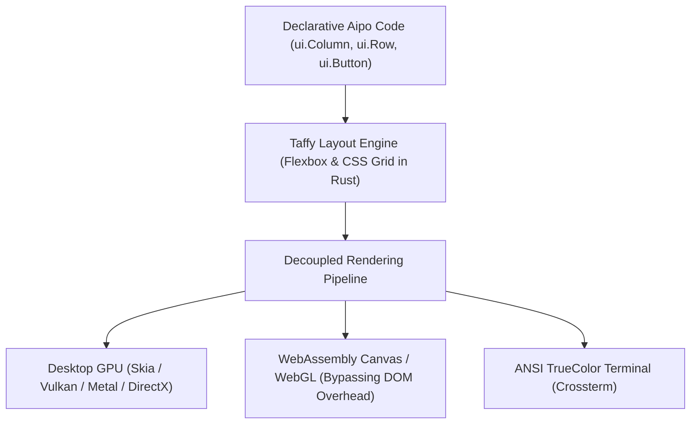

::: info Static copy
Copied from `docs/en/packages/aipo-ui.md` in [https://github.com/poppy-team/aipo-lang](https://github.com/poppy-team/aipo-lang) (MIT).
Pinned to revision `7d51026653301c3048a41e2cf4026e3429c3a3b9`, blob `239ffff03e645d6c60e628f396f511a698275fd6`.
The source repository remains canonical; this copy is refreshed through a sync pull request, not live.
:::
# aipo.ui — Universal Multiplatform UI Framework

`aipo.ui` is the official user interface framework of the Aipo programming language for building declarative, cross-platform graphical applications capable of running natively on **Desktop (GPU)**, on the **Web (Canvas/WebGL via WebAssembly)**, and in the **Terminal (TUI)** from a single codebase.

---

## 1. Overview & Domain Separation

In the Aipo ecosystem, architectural separation of concerns is strictly preserved:

- **[`aipo.html`](https://github.com/poppy-team/aipo-lang/blob/7d51026653301c3048a41e2cf4026e3429c3a3b9/docs/en/en/packages/aipo-html)**: Designed exclusively for standard web browsers. Operates directly on the host DOM tree (`<div>`, `<span>`, CSS, Tailwind).
- **`aipo.ui`**: 100% platform-agnostic. Constructs a declarative tree of layout nodes and high-level controls, computes spatial geometry via the Rust **Taffy** engine (CSS Flexbox and CSS Grid), and delegates rendering to decoupled backends.



---

## 2. Installation

Add to your project's `aipo.toml`:

```toml
[dependencies]
"aipo.ui" = { path = "packages/aipo-ui" }
```

---

## 3. Quick Example: Universal Application

```aipo
import aipo.ui as ui
import aipo.ui.color as color

struct Model {
    count: Int
    theme_dark: Bool
}

enum Msg {
    Increment,
    Decrement,
    ToggleTheme
}

fn update(m: Model, msg: Msg) -> Model {
    match msg {
        Msg::Increment => Model{ count: m.count + 1, theme_dark: m.theme_dark },
        Msg::Decrement => Model{ count: m.count - 1, theme_dark: m.theme_dark },
        Msg::ToggleTheme => Model{ count: m.count, theme_dark: !m.theme_dark }
    }
}

fn view(m: Model, dispatch: Fn) {
    let bg_color = if m.theme_dark { color.gray_900 } else { color.gray_100 }
    let card_bg = if m.theme_dark { color.gray_800 } else { color.white }
    let text_color = if m.theme_dark { color.white } else { color.gray_900 }

    ui.Column(
        width: "100%",
        height: "100%",
        padding: 32,
        align: ui.Align::Center,
        justify: ui.Justify::Center,
        background: bg_color
    ) {
        ui.Box(
            padding: 24,
            border_radius: 12.0,
            background: card_bg,
            align: ui.Align::Center
        ) {
            ui.Text("Aipo Universal UI", font_size: 24, font_weight: "bold", color: text_color)
            ui.Spacer()
            
            ui.Text(f"Count: {m.count}", font_size: 40, font_weight: "bold", color: color.blue_500)
            
            ui.Row(gap: 8, padding: 16) {
                ui.Button("+1", on_click: _ => dispatch(Msg::Increment), variant: "primary")
                ui.Button("-1", on_click: _ => dispatch(Msg::Decrement), variant: "secondary")
                ui.Button("Toggle Theme", on_click: _ => dispatch(Msg::ToggleTheme))
            }
        }
    }
}

fn main() {
    ui.mount_desktop(
        title = "Aipo UI Demo",
        width = 500,
        height = 400,
        init = Model{ count: 0, theme_dark: true },
        update = update,
        view = view
    )
}
```

---

## 4. Layout Primitives

Layout primitives utilize Aipo's trailing blocks `{ ... }` and map directly to standard CSS Flexbox and Grid rules handled by the **Taffy** engine:

### `ui.Column`
Stacks child elements vertically:
```aipo
ui.Column(gap: 12, padding: 16, align: ui.Align::Center) {
    ui.Text("Item 1")
    ui.Text("Item 2")
    ui.Text("Item 3")
}
```

### `ui.Row`
Lays out child elements horizontally:
```aipo
ui.Row(gap: 8, justify: ui.Justify::SpaceBetween) {
    ui.Text("Left")
    ui.Text("Right")
}
```

### `ui.Stack`
Overlays child elements across the Z-axis, ideal for badges, backdrops, and floating layers:
```aipo
ui.Stack(width: 200, height: 120) {
    ui.Box(background: color.gray_200, width: "100%", height: "100%")
    ui.Text("Overlaid", align: "center")
}
```

### `ui.ScrollArea`
Scrollable container with accelerated clipping for lists or oversized content:
```aipo
ui.ScrollArea(height: 300, direction: "vertical") {
    each item in item_list {
        ui.Text(item)
    }
}
```

### `ui.Spacer`
Elastic container with `flex_grow: 1` that expands to fill available space, pushing siblings apart.

---

## 5. Controls & Interactive Components

| Component | Key Properties | Example |
|---|---|---|
| `ui.Text` | `content`, `font_size`, `font_weight`, `color`, `align` | `ui.Text("Hello World", font_size: 16)` |
| `ui.Button` | `label`, `on_click`, `variant`, `disabled` | `ui.Button("Save", on_click: _ => dispatch(Msg::Save))` |
| `ui.TextInput` | `value`, `placeholder`, `on_change`, `disabled` | `ui.TextInput(placeholder: "Name...", on_change: val => dispatch(Msg::SetName(val)))` |
| `ui.Slider` | `value`, `min`, `max`, `step`, `on_change` | `ui.Slider(value: 50.0, min: 0.0, max: 100.0)` |
| `ui.Checkbox` | `checked`, `label`, `on_toggle` | `ui.Checkbox(checked: true, label: "Accept terms")` |
| `ui.ProgressBar` | `progress` (0.0 to 1.0), `height`, `color` | `ui.ProgressBar(progress: 0.75, color: color.emerald_500)` |

---

## 6. Color System & Typed Styles

The `aipo.ui.color` submodule provides type-safe constructors and standard design palettes:

```aipo
import aipo.ui.color as color

# Constructors
let c1 = color.rgb(30, 41, 59)
let c2 = color.rgba(255, 255, 255, 0.8)
let c3 = color.hex("#4f46e5")

# Canonical Palette
color.white
color.black
color.gray_900
color.blue_500
color.emerald_500
color.red_500
```

---

## 7. Renderers & Mount Targets

Depending on your compilation target, `aipo.ui` supports dedicated mount routines:

### Native Desktop GPU (`mount_desktop`)
Creates an accelerated window powered by Skia (Vulkan on Linux, Metal on macOS, DirectX 12 on Windows):
```aipo
ui.mount_desktop(
    title = "Desktop Application",
    width = 1024,
    height = 768,
    init = init_state,
    update = update,
    view = view
)
```

### WebAssembly Canvas 2D / WebGL (`mount_canvas`)
Compiles to WebAssembly and renders directly to an HTML5 `<canvas id="app-canvas">`, bypassing the browser DOM for performance-critical tools and dashboards:
```aipo
ui.mount_canvas("app-canvas", init = init_state, update = update, view = view)
```

### Terminal TUI (`mount_tui`)
Runs dashboards, CLI tools, and metric viewers in ANSI terminal environments without X11/Wayland:
```aipo
ui.mount_tui(init = init_state, update = update, view = view)
```
