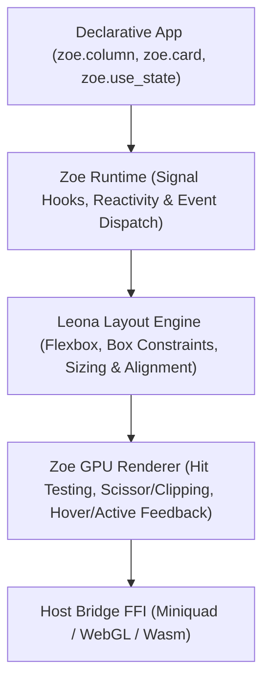

::: info Static copy
Copied from `docs/en/packages/aipo-zoe.md` in [https://github.com/poppy-team/aipo-lang](https://github.com/poppy-team/aipo-lang) (MIT).
Pinned to revision `d9f9557e04871546a92b7ca1fcbc7e6f116803f8`, blob `604400db5201cb5e2fddd214162ef44158abc7af`.
The source repository remains canonical; this copy is refreshed through a sync pull request, not live.
:::
# aipo.zoe — Declarative GUI Framework & Leona Engine

`aipo.zoe` (Zoe UI) is the canonical framework of the Aipo programming language for building high-performance, data-rich declarative graphical user interfaces, featuring hardware-accelerated 60+ FPS GPU rendering via [`aipo-game-host`](https://github.com/poppy-team/aipo-lang/blob/d9f9557e04871546a92b7ca1fcbc7e6f116803f8/docs/en/en/packages/aipo-game), reactive state management with hooks (`use_state`), and the hierarchical **Leona** layout engine.

---

## 1. Overview & Design Philosophy

Zoe UI was engineered with a non-negotiable principle: **pure code written in Aipo**, eliminating heavy layers of C++, Electron, or operating system widget wrappers, without sacrificing hardware acceleration or modern ergonomics.



### Core Tenets:
1. **Zero Native Bloat in the UI Layer:** The entire component tree, bounding box calculation, and event management are expressed in pure Aipo syntax.
2. **Predictable & Deterministic Reactivity:** State changes trigger clean updates through the frame cycle (`step(dt)`), orchestrating re-evaluation free of ghost side-effects.
3. **Tooling & Game Engine First:** First-class support for GPU scissor-clipped viewports, resizable splitters, hierarchy tabs, 2D/3D orbit cameras, and visual transformation gizmos.
4. **Cross-Platform by Design:** Runs on desktop native VMs (Linux, macOS, Windows) and is architecturally aligned for WebAssembly (`aipo-wasm`) and JavaScript (`aipo-js`).

---

## 2. Installation & Quickstart

Add the dependency to your project's `aipo.toml`:

```toml
[dependencies]
"aipo.zoe" = { path = "packages/aipo-zoe" }
```

### Quickstart: Reactive Counter with Built-in Design System

```aipo
import aipo.zoe as zoe

fn view() {
    let count = zoe.use_state(0)

    return zoe.center({ "background": zoe.color.base, "gap": 16.0 }, [
        zoe.label(f"Counter: {count.get()}", {
            "font_size": 24.0,
            "color": zoe.color.text
        }),
        zoe.row({ "gap": 12.0 }, [
            zoe.button("+1 Increment", _ => zoe.set_state(count, count.get() + 1), {
                "variant": "primary",
                "background": zoe.color.blue
            }),
            zoe.button("Reset", _ => zoe.set_state(count, 0), {
                "variant": "danger",
                "background": zoe.color.red
            })
        ])
    ])
}

fn setup() {
    zoe.mount(view)
}

fn update(dt) {
    zoe.step(dt)
}

fn draw() {
    zoe.draw_ui()
}
```

---

## 3. Market Comparative Analysis (Philosophical Inspirations)

To plan Zoe UI's maturation, we analyzed the best industry tools that share the same philosophy: *declarative UI drawn directly onto a GPU/Canvas surface in the host language itself*:

| Framework / Library | Substrate / Language | Shared Philosophy with Zoe | Practical Lessons & Inspirations |
| :--- | :--- | :--- | :--- |
| **[Freya GUI](https://freyaui.dev/)** | Rust + **Torin Layout** + Skia | Closest architectural sibling. Has its own node-oriented layout engine (**Torin**), signal reactivity, and canvas rendering. | **Layout node caching:** Torin only recalculates nodes whose properties, available bounds, or children changed. |
| **[Flutter](https://flutter.dev/)** | Dart + Impeller/Skia | Direct GPU canvas rendering without OS widgets; pure declarative tree in the language. | **Bidirectional Layout Protocol:** *"Constraints go down, sizes go up, parent sets position"*. Eliminates ambiguities and runs in strict $O(N)$. |
| **[Egui](https://github.com/emilk/egui)** | Rust (Immediate Mode) | Uncompromising focus on developer tools, game engines, debuggers, and lightweight visual editors. | **Floating Overlay Layers (Portals/Overlays):** Right-click context menus, hover-delayed tooltips, and straightforward modal dialogs. |
| **[SolidJS](https://www.solidjs.com/)** | TypeScript (Fine-Grained Signals) | Surgical reactivity without full Virtual DOM reconciliation overhead. | **Fine & Computed Signals (`use_memo` / `use_effect`):** Trigger granular re-layout only on affected subtrees instead of invalidating the entire window. |
| **[Slint](https://slint.dev/)** | Rust/C++ | Declarative interface with microscopic memory footprint and property bindings. | **Explicit Min/Max Constraints:** `min_width`, `max_width`, `min_height`, `max_height` as first-class layout citizens. |

---

## 4. Architectural Maturation Axes

Based on the audit of Zoe UI's codebase, six strategic improvement axes are established:

### Axis 1: Leona Layout Engine 2.0 (Constraints & Cache)
* **Bidirectional Measurement (Constraints Go Down, Sizes Go Up):**
  Leona will adopt two clean passes:
  1. *Measurement Pass (Bottom-Up):* Children report their intrinsic minimum and preferred size to the parent container.
  2. *Positioning Pass (Top-Down):* The parent container imposes boundary constraints and computes final absolute `(x, y)` coordinates.
* **Min/Max Constraints:** Native support for `min_width`, `max_width`, `min_height`, and `max_height` on all elements and containers.
* **Multi-Line Flow (`wrap: true`):** Flowing layouts for tool palettes, media galleries, and tag collections.
* **Layout Caching (Torin-Style):** Static elements with identical constraints reuse precomputed geometry in $O(1)$.
* **Host Typography Measurement:** Replacing monospace estimations with `host_measure_text(text, font_size) -> [w, h]` in the host layer.

### Axis 2: Fine-Grained Reactivity & Advanced Hooks
* **`use_memo`:** Computed derived state cached by signal dependencies:
  ```aipo
  let filtered = zoe.use_memo([query, items], fn() {
      return items.get().filter(it => it.contains(query.get()))
  })
  ```
* **`use_effect`:** Side effects and async triggers executed only when specified signals change.
* **Subtree Invalidation:** Eliminating global `rebuild_tree()` to isolate unmutated components.

### Axis 3: Floating Surfaces (Portals & Overlays)
* **Overlay Stack (`OverlayStack`):** Guaranteed top-level rendering pass after base-tree scissor clipping resolves.
* **True Floating Dropdowns:** `dropdown_select` opening a hovering options panel with shadow and border over adjacent UI panels.
* **Automatic Tooltips:** Floating popover bubbles triggered by sustained hover (`tooltip: "Tooltip description"`).
* **Modals & Confirmation Dialogs:** Backdrop dimming (*scrim*) with focus trapping and external click shielding.
* **Context Menus:** Right-click contextual popups triggered on any component.

### Axis 4: Input, Focus & Accessibility System
* **Keyboard Navigation:** `Tab` and `Shift+Tab` cycles focus across buttons, text fields, and selectors.
* **Keyboard Activation:** `Space` and `Enter` trigger focused controls; arrow keys adjust sliders and selectors.
* **Focus Ring:** Consistent visual focus outline indicating the active element.
* **Semantic Cursor Management:** Instructing the host to switch between default pointer, `pointer` (buttons), `ibeam` (inputs), and `resize_ew` / `resize_ns` (splitters).

### Axis 5: Tooling & Game Engine Specialized Controls
* **`tree_view` (Collapsible Hierarchy):** Crucial for scene entity trees, node graphs, and asset browsers with expand/collapse and selection.
* **`virtual_list` (Virtual List):** Only renders elements visible in the viewport, supporting 10,000+ items with constant $O(1)$ memory usage.
* **Multiline `text_area`:** Support for automatic line wrapping, multiline editing, text selection, and clipboard shortcuts.

### Axis 6: Delta-Time Animation & Interpolation Engine
* **`use_spring` and `use_tween`:** Smooth physics-based and linear interpolation using the existing `dt` parameter in `step(dt)`:
  ```aipo
  let anim_pos = zoe.use_spring(is_open.get() ? 280.0 : 0.0, { "stiffness": 150.0, "damping": 15.0 })
  ```

---

## 5. Implementation Roadmap & Evolution 2.0

| Milestone | Title | Status | Technical Deliverables |
| :---: | :--- | :---: | :--- |
| **M1** | **Floating Overlays & Menus** | Completed | `OverlayStack` in the renderer; true floating dropdowns; automatic tooltips. |
| **M2** | **Leona Constraints & Intrinsic Wrap** | Completed | `min_*`, `max_*`, `wrap: true`, spatial `stack` container, and intrinsic measurements. |
| **M3** | **Fine-Grained Reactivity & Memoization** | Completed | `use_memo` and `use_effect` hooks; selective dirty subtree invalidation. |
| **M4** | **Keyboard Navigation & Focus** | Completed | Focus traversal via `Tab`/`Shift+Tab`, visual focus rings, and global shortcuts. |
| **M5** | **Productivity & Tooling Controls** | Completed | Hierarchical `tree_view` and virtualized `virtual_list` component. |
| **M6** | **Micro-animations & DevTools Inspector** | Completed | Continuous `use_tween` interpolation and live layout geometry inspector with <kbd>F12</kbd>. |
| **M7** | **Design Tokens & Vector Icons** | Completed | `tokens.aipo`, native vector engine with `tiny-skia` + GPU `Texture2D` cache, Lucide/Heroicons/Tabler/Devicons icons, and precision controls (`scrubber_input`, `segmented_group`, `hierarchy_tree`). |
| **M8** | **Subpixel Typography Engine & Inter Font** | ✅ Completed | `fontdue` integration, embedded Inter TTF font, `host_measure_text`, and `host_font_metrics`. |
| **M9** | **Analytical UI Shaders (GPU SDF)** | ✅ Completed | SDF Fragment Shader for analytical rounded quads, continuous 1px borders, and physical top inner highlight on GPU (`host_draw_sdf_rect`). |
| **M10** | **Leona 2.0 (Flexbox & Baseline Alignment)** | Planned | Glyph-driven intrinsic measurement pass, strict flex clamping without overflow, and font baseline alignment. |
| **M11** | **Component Protocol & Advanced Widgets** | Planned | Universal component contract, virtualized `code_editor` with Aipo lexical highlighting, and vector `node_graph` for blueprints/shaders. |
| **M12** | **Dedicated Docs Site & Wasm Playground** | Planned | Dedicated microsite with Storybook-style interactive component showcase and WebAssembly playground running live Aipo in browser canvas. |
