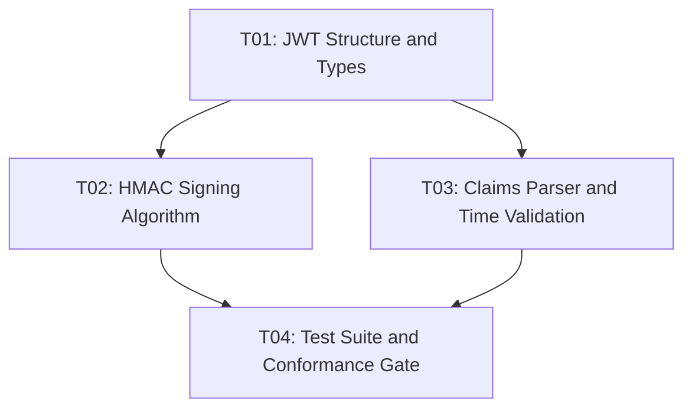

::: info Static copy
Copied from `docs/en/harness/directives.md` in [https://github.com/poppy-team/prumo](https://github.com/poppy-team/prumo) (MIT).
Pinned to revision `e91694d3959be1ed92757b34063efe0b2191821f`, blob `c916d5f414fb9d0895c6a69b10fbad7e031cb09c`.
The source repository remains canonical; this copy is refreshed through a sync pull request, not live.
:::
# Directives & Task DAGs

In Prumo, AI agents do not work from open-ended, vague instructions. Instead, the Prumo compiler turns Goals and Tasks into structured **Executable Directives** in JSON Schema Draft 2020-12 format.

## Structure of a Directive

Each directive encapsulates the strictly necessary context (LPC) and the corresponding validation rule:

```json
{
  "$schema": "https://prumo.dev/schemas/directive.json",
  "directive_id": "DIR-P01-G01-T01",
  "goal_ref": "P01-G01",
  "task_ref": "T01",
  "actor": "systems-core",
  "context_capsule": {
    "target_files": ["internal/auth/jwt.go", "internal/auth/jwt_test.go"],
    "referenced_contracts": ["security.trust-model", "architecture.dependency-rules"],
    "budget_tokens": 8000
  },
  "acceptance_criteria": [
    "TestJWTVerification must pass with at least 90% coverage",
    "No external package beyond the stdlib may be added to go.mod"
  ],
  "verification_command": "go test ./internal/auth/... -race"
}
```

## Directed Acyclic Graph (DAG) of Tasks

When a Plan is formulated, its tasks form a deterministic DAG:



1. **Safe Parallel Execution**: Tasks with no mutual dependencies can be executed simultaneously by distinct specialist agents.
2. **Blocking Gates**: Advancing to the next task is only released once the previous gate's success evidence has been produced.
3. **Deterministic Rollback**: If a verification fails, Prumo preserves the intermediate state and creates a diagnostic checkpoint without corrupting the main Git tree.
